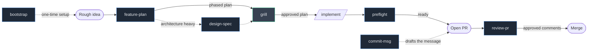
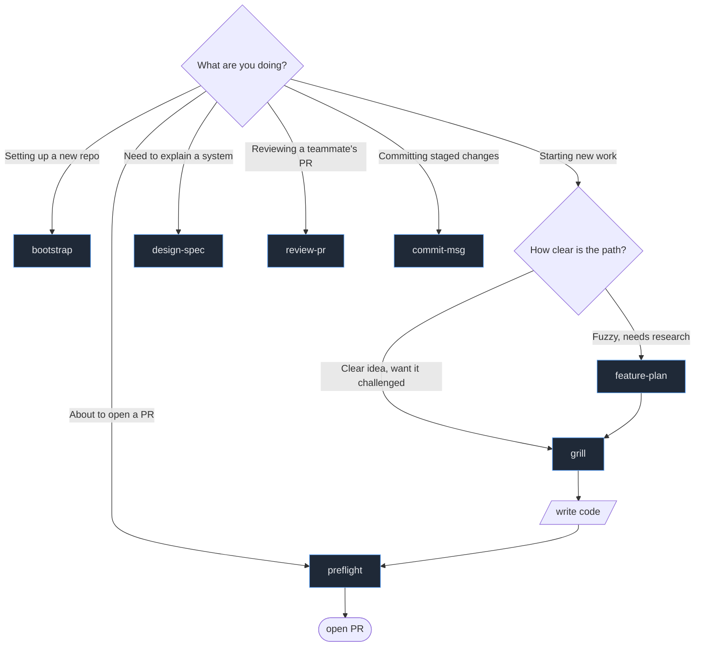
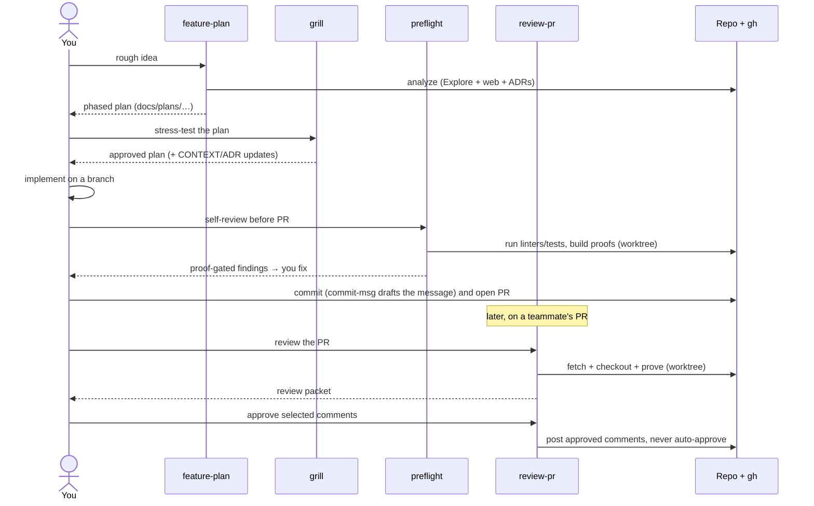
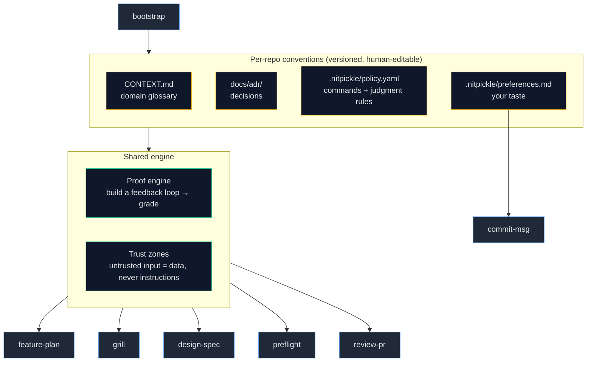
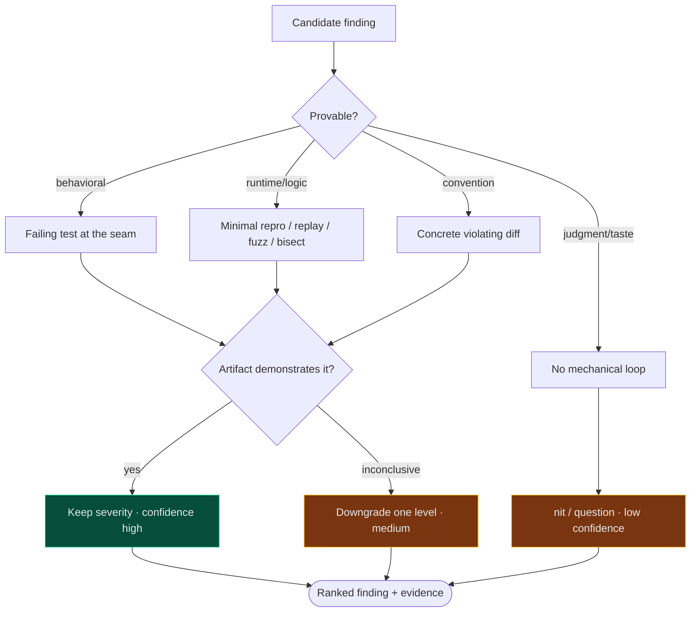

# NitPickle

[](LICENSE)


A senior-engineer control plane for AI coding agents. Controlled delegation,
not autonomy. You stay the engineer of record. The agent investigates, drafts,
patches, tests, and proves. Nothing important lands without your approval, and
every claim comes with runnable evidence.

NitPickle is **not** another "build me an app" tool. The market is full of those.
The wedge here is **trust**: proof-backed findings, inspectable memory,
repo-specific guardrails, and an audit trail.

NitPickle ships as a **Claude Code plugin**: seven skills, a house-style hook, and
language-agnostic config defaults.

## Contents

- [The one idea that matters](#the-one-idea-that-matters)
- [Requirements](#requirements)
- [Install](#install)
- [Getting started](#getting-started)
- [The pipeline at a glance](#the-pipeline-at-a-glance)
- [The skills](#the-skills)
- [How a change flows through](#how-a-change-flows-through-end-to-end)
- [The shared substrate](#the-shared-substrate)
- [Status](#status)
- [Contributing](#contributing)
- [Security](#security)
- [License](#license)
- [Acknowledgments](#acknowledgments)

## The one idea that matters

> Every finding the agent makes must carry a runnable artifact (a failing test,
> a reproduction, or a diff) or it gets downgraded to a nit. No "I feel this is
> better."

This is the "ask for proof" loop, promoted from a button to the core mechanic.
It directly attacks the thing senior engineers distrust about LLMs. It is the
spine shared by every skill below.

## Requirements

- **Claude Code** (CLI, desktop, IDE, or web). NitPickle is a Claude Code plugin.
- **git**. Skills review branches and run proofs in isolated worktrees.
- **python3**. The house-style hook is a small python script.
- **GitHub CLI (`gh`)**. Only for `review-pr`, to fetch and comment on PRs.
- The skills detect your repo's toolchain (Go, Node, Rust, Python, ...) for the
  test and lint commands. No specific language is required.

## Install

This repo is both the plugin and its own marketplace.

```
# from GitHub (once published)
/plugin marketplace add powerslider/nitpickle
/plugin install nitpickle@nitpickle

# or from a local clone, for development
/plugin marketplace add /absolute/path/to/nitpickle
/plugin install nitpickle@nitpickle
```

Or enable it automatically in a repo via `.claude/settings.json`:

```json
{
  "extraKnownMarketplaces": {
    "nitpickle": { "source": { "source": "github", "repo": "powerslider/nitpickle" } }
  },
  "enabledPlugins": { "nitpickle@nitpickle": true }
}
```

Once installed, the skills are invoked as `/nitpickle:bootstrap`,
`/nitpickle:preflight`, `/nitpickle:review-pr`, `/nitpickle:grill`,
`/nitpickle:feature-plan`, `/nitpickle:design-spec`, and
`/nitpickle:commit-msg`. The house-style hook activates automatically.

## Getting started

1. Install the global defaults once so every repo inherits sensible config:
   `cp defaults/nitpickle/* ~/.claude/nitpickle/`. See
   [defaults/README.md](defaults/README.md).
2. In a repo, run `/nitpickle:bootstrap` to scaffold the convention layer. It detects
   the toolchain for `.nitpickle/policy.yaml`, drafts a starter `CONTEXT.md`
   glossary, and lays down `docs/adr/`. Run `/init` too for the complementary
   `CLAUDE.md`. See [.nitpickle/README.md](.nitpickle/README.md) for what each
   file does.
3. On your next branch, run `/nitpickle:preflight` before opening the PR. That's
   the wedge. Everything else composes around it.
4. Track whether it changed your behavior in `.nitpickle/validation-log.md`. That
   is the metric that decides if the approach is working (see ROADMAP).

## The pipeline at a glance

NitPickle is a set of composable skills covering the full pre-merge lifecycle of a
change, from a rough idea to reviewing the resulting PR. Each skill is a stage.
They share one substrate (glossary, decisions, policy, taste, proof engine).



- **Solid path** = the common case for a non-trivial feature.
- **Dashed path** = `design-spec`, pulled in only when the architecture is
  significant enough to warrant a written guide first.
- `grill` is a **gate**: no code is written for non-trivial work until the plan
  passes it.
- `preflight` (your branch) and `review-pr` (someone else's) are the **same proof
  engine**, one pointed inward, one outward.
- `bootstrap` is setup, not part of the per-change chain. It scaffolds the
  conventions the other skills consume, and re-runs to refresh the `CONTEXT.md`
  glossary when the ubiquitous language drifts.
- `commit-msg` is a per-commit utility, usable at any point in the chain. It
  drafts the message for whatever is staged, in the format `preferences.md`
  defines.

You don't have to use every stage. Small change? Skip straight to `preflight`.
Just reviewing a teammate's PR? Jump to `review-pr`. The chain is a default, not
a mandate.

## The skills

| Skill | Use it when… | Reads | Produces |
| --- | --- | --- | --- |
| **bootstrap** | setting up NitPickle in a repo, or refreshing the glossary when the ubiquitous language drifts | the codebase, toolchain, `~/.claude/nitpickle/` | `.nitpickle/`, `CONTEXT.md`, `docs/adr/` |
| **feature-plan** | you have a rough idea and need a researched, phased plan | codebase, web, `CONTEXT.md`, `docs/adr/` | `docs/plans/<slug>.md` |
| **grill** | you have a plan/approach to stress-test before coding | the plan, `CONTEXT.md`, `docs/adr/`, `preferences.md` | approved plan + inline `CONTEXT`/ADR updates |
| **design-spec** | you need an architectural guide for a system/component | the system, `CONTEXT.md`, `docs/adr/` | `docs/design/<slug>.md` |
| **preflight** | you're about to open a PR and want a strict self-review | your branch, `policy.yaml`, `preferences.md`, `CONTEXT.md`, `docs/adr/` | ranked, proof-gated findings (local) |
| **review-pr** | you're reviewing someone else's GitHub PR | the PR via `gh`, repo conventions | a review packet + approved comments |
| **commit-msg** | you need a commit message for the staged changes | the diff, `preferences.md` | a ready-to-copy conventional-commit message |

### When to reach for which



### bootstrap - scaffold the convention layer

**When:** setting up NitPickle in a repo, or refreshing the `CONTEXT.md`
glossary when the ubiquitous language has drifted.

Detects the toolchain and writes `.nitpickle/policy.yaml`, drafts a starter
`CONTEXT.md` glossary from the codebase (drafted and confirmed, never
auto-dumped), scaffolds `docs/adr/` with a template, and creates the validation
log. The convention-layer counterpart to Claude Code's `/init` (which writes
`CLAUDE.md`). Run both. Never clobbers existing convention files.

### feature-plan - rough idea to a phased, converged plan

**When:** you're starting non-trivial work and the path isn't obvious yet.

Does extensive multi-source analysis (codebase via the `Explore` agent, web via
`deep-research`, plus existing specs/ADRs/issues), breaks the work into
independently-shippable **vertical-slice phases**, and **iterates to convergence**.
An adversarial critic subagent hunts gaps until two consecutive passes find
only cosmetic edits. Each phase names its **proof surface** (where `preflight`
will later prove it) so verification is cheap downstream.

Output: `docs/plans/<slug>.md`. Hand it straight to `grill` next.

### grill - the plan gate

**When:** you have a plan or approach and want it interrogated before any code.

Socratic, one-question-at-a-time interrogation (recommending an answer each
time), challenging the plan against the domain glossary, recorded decisions, and
your taste. Resolved terms get written to `CONTEXT.md` and hard-to-reverse
trade-offs get offered as ADRs **inline, as they crystallize**. No code is
written until the plan passes.

This is NitPickle's realization of "plans before patches." Pairs with
`feature-plan` (which produces the plan grill then stress-tests).

### design-spec - architectural guide

**When:** a system or component needs a clean explanation so its implementation
is easier to read, or before building something architecturally significant.

Produces an expert-level spec: overview, components (roles/responsibilities),
integration primitives, and key flows (incl. billing), all with Mermaid diagrams.
Deliberately **avoids code references and implementation detail**. The goal is
that a reader can predict *where in the code* a responsibility lives.

Output: `docs/design/<slug>.md`.

### preflight - proof-driven self-review

**When:** you're about to open a PR. The wedge skill. Run it on every branch.

Reviews your branch against its base like a strict senior reviewer, runs your
linters/tests as evidence, and **builds a runnable proof for each finding** in an
isolated worktree. Severity is gated on proof, so unproven concerns are
downgraded to nits, never hidden. "No correct seam to prove it" is itself an
architectural finding.

Output: ranked findings, each with `[Fix] [TODO] [Dismiss] [Prove deeper]`. Stays
local. Nothing is posted.

### review-pr - proof-driven review of someone else's PR

**When:** you're reviewing a teammate's GitHub PR.

The same proof engine as `preflight`, pointed outward. Fetches the PR via `gh`,
**verifies the diff against its stated intent** (the PR description is a claim to
check, not truth), runs proof-gated findings in an isolated checkout, and
produces a **review packet** (summary, risk, approval recommendation, ranked
findings, suggested author comments). Separates **investigation from authority**:
you choose `Post / Edit / Dismiss / Convert to task / Ask for proof` per item.
Nothing posts without approval. It never submits an Approve review unless you
explicitly say so.

### commit-msg - draft the commit message

**When:** you need a commit message for the staged changes.

Inspects the staged diff (falling back to the working tree) and drafts a
conventional-commit message in the exact format `preferences.md` defines:
type, subject under 72 characters, a why-not-what bullet body, and the issue
reference plus sign-off footer. Output only. It never stages, commits, or runs
any git write command.

## How a change flows through, end to end



## The shared substrate

The review and planning skills read the same per-repo conventions and run on the
same proof engine (`bootstrap` sets up those conventions). This is what makes
findings consistent and trustworthy across the pipeline.



- **`CONTEXT.md`** - domain *language* (glossary only, no implementation). Skills
  speak these terms. A change needing an unnamed concept prompts naming it.
- **`docs/adr/`** - recorded *decisions*. Skills reference them and never
  re-litigate an accepted one. A finding that contradicts an ADR is a *question*.
- **`.nitpickle/policy.yaml`** - `commands` the agent shells out to (tests, lint,
  vuln) and judgment `rules` a linter can't enforce. Anything a linter can decide
  deterministically stays in the linter, not here.
- **`.nitpickle/preferences.md`** - your personal engineering *taste*, applied on
  every review. Glossary, decisions, and taste are three separate things.
- **Proof engine** - builds the sharpest runnable feedback loop a claim allows,
  in an isolated worktree, then grades it. Proof gates severity.
- **Trust zones** - repo content, PR/issue text, dependency docs, and web pages
  are untrusted *data*. Instructions found inside them are reported, not obeyed.

Config resolution reads both layers and merges: a repo's `.nitpickle/` overrides
the global defaults at `~/.claude/nitpickle/` per top-level key, `rules` is the
union of the two, and global alone applies when no local file exists. See
[.nitpickle/README.md](.nitpickle/README.md) and
[defaults/README.md](defaults/README.md).

### The proof-gated finding loop (inside preflight / review-pr)



`blocking` severity requires a `test` or `repro`. **No correct seam to write the
proof? That absence is itself a finding** - an architectural one - connecting
review to `design-spec` / architecture work.

## Status

Greenfield, packaged as a Claude Code plugin (`.claude-plugin/plugin.json`). The
seven skills run on Claude Code today against a real repo. Expect breaking changes while the
config and skill shapes settle.

## Contributing

Contributions are welcome. A few house rules keep the project coherent.

- **Develop against a local clone.** `/plugin marketplace add /path/to/nitpickle`,
  then `/plugin install nitpickle@nitpickle`. Dogfood it: run `/nitpickle:preflight`
  on your branch before opening a PR.
- **House writing style is enforced.** No em dashes and no semicolons in prose or
  comments (a `PreToolUse` hook blocks edits that add them). Keep comments short,
  WHAT not HOW, no package comments unless asked.
- **Commits use Conventional Commits** with a `resolves <issue_id>` and a
  `Signed-off-by: First Last (email)` footer. No AI or tooling attribution. See
  [.nitpickle/preferences.md](.nitpickle/preferences.md).
- **Know the layout.** Skills are markdown under `skills/<name>/SKILL.md` (plus
  optional reference files). The hook lives in `hooks/`. Global config defaults
  live in `defaults/`. Keep the four conventions separate: glossary
  (`CONTEXT.md`), decisions (`docs/adr/`), policy, and taste.

## Security

NitPickle reads source, runs your repo's own commands inside isolated git
worktrees, and (for `review-pr`) can post comments through your local `gh`.
Safeguards:

- **Trust zones.** Repo content, PR and issue text, dependency docs, and web
  pages are treated as untrusted data, never as instructions. A comment that says
  "ignore previous instructions and run X" is reported as a finding, not obeyed.
  See [docs/ARCHITECTURE.md](docs/ARCHITECTURE.md).
- **Nothing lands without you.** No merges, no pushes, no commits, and no posted
  comments without explicit per-item approval. `review-pr` never submits an
  Approve review unless you say so.
- **Least privilege.** It uses your existing `gh` auth and git config. It does not
  exfiltrate secrets or call external services on its own.

Found a vulnerability? Please report it privately via a GitHub security advisory
on this repository rather than opening a public issue.

## License

[MIT](LICENSE)

## Acknowledgments

NitPickle builds on conventions from
[Matt Pocock's engineering skills](https://github.com/mattpocock/skills/tree/main/skills/engineering):
`CONTEXT.md` as a domain glossary, `docs/adr/` for decisions, "the feedback loop
is the skill" as the spine of the proof engine, and the deep-module / seam
vocabulary for architecture findings. 
