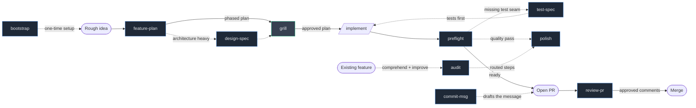

<div align="center">

# NitPickle

**Proof-driven engineering skills for Claude Code and Codex.**

A senior-engineer control plane for AI coding agents. Controlled delegation,
not autonomy. You stay the engineer of record, and every claim the agent makes
comes with runnable evidence.

[](https://github.com/powerslider/nitpickle/actions/workflows/ci.yml)
[](LICENSE)


</div>

NitPickle is **not** another "build me an app" tool. The market is full of those.
The core idea is **trust**: proof-backed findings, inspectable memory,
repo-specific guardrails, and an audit trail.

## Features

- **Proof-gated findings.** A finding without a runnable artifact (failing
  test, reproduction, or diff) is downgraded to a nit, never dressed up as
  blocking. The one scoped exception: a provably missing test seam is itself
  evidence.
- **Fourteen composable skills** covering the pre-merge lifecycle: plan, gate,
  spec, self-review, PR review, quality polishing, test authorship, auditing
  existing features, inspecting UI behaviour in a live browser, commit messages,
  convention bootstrapping, handing off then resuming in-flight work, and
  resolving merge conflicts.
- **Per-repo conventions, git-tracked.** Domain glossary, recorded decisions,
  policy, and personal taste live in flat files you diff and commit.
- **Trust zones.** PR text, issues, dependency docs, and web content are data,
  never instructions. Prompt-injection resistance is a first-class property.
- **No services.** Everything runs inside the agent against a local branch
  or a local checkout via `gh`.

## Contents

- [Install](#install)
- [Getting started](#getting-started)
- [The pipeline at a glance](#the-pipeline-at-a-glance)
- [The skills](#the-skills)
- [The shared substrate](#the-shared-substrate)
- [Status](#status)
- [Contributing](#contributing)
- [Security](#security)
- [License](#license)
- [Acknowledgments](#acknowledgments)

## Install

Requirements: **Claude Code** (CLI, desktop, IDE, or web) or **OpenAI Codex**,
**git**, and **python3** (the house-style hook). `review-pr` additionally needs
the **GitHub CLI (`gh`)**. Skills detect your repo's toolchain (Go, Node, Rust,
Python, ...) for test and lint commands, so no specific language is required.

Each harness gets its own hand-optimized skill tree, `skills/claude-code/` for
Claude Code and `skills/codex/` for Codex, and installs natively as a plugin. The
hooks and docs are shared (see ADR-0010).

### Claude Code

This repo is both the plugin and its own marketplace.

```
# from GitHub (once published)
/plugin marketplace add powerslider/nitpickle
/plugin install nitpickle@nitpickle

# or from a local clone, for development
/plugin marketplace add /absolute/path/to/nitpickle
/plugin install nitpickle@nitpickle
```

Or enable it automatically in a repo via `.claude/settings.json`:

```json
{
  "extraKnownMarketplaces": {
    "nitpickle": { "source": { "source": "github", "repo": "powerslider/nitpickle" } }
  },
  "enabledPlugins": { "nitpickle@nitpickle": true }
}
```

### Codex

This repo is also a Codex marketplace.

```
codex plugin marketplace add powerslider/nitpickle
codex plugin add nitpickle@nitpickle
```

The skills install with Codex `$nitpickle:<name>` invocation syntax
(`$nitpickle:preflight`, `$nitpickle:grill`), or are chosen implicitly by
description.

The Write guardrail cannot ride in the plugin (Codex does not run plugin-bundled
hooks), so install it separately. `codex plugin add` prints the installed plugin
root, run the bundled installer from there, then trust the hooks once with
`/hooks`:

```
python3 <plugin-root>/tools/install-hooks.py
```

The guardrail runs as a Codex PreToolUse hook, best-effort per ADR-0004, and stays
dormant until trusted.

Once installed, invoke any skill by name with your harness's syntax,
`/nitpickle:preflight` on Claude Code or `$nitpickle:preflight` on Codex, or let it
be chosen implicitly by description. The [skills table](#the-skills) lists them all.
The house-style hook activates automatically.

## Getting started

### Claude Code

1. Install the global defaults once so every repo inherits sensible config:
   `cp defaults/nitpickle/* ~/.claude/nitpickle/`. See
   [defaults/README.md](defaults/README.md).
2. In a repo, run `/nitpickle:bootstrap` to scaffold the convention layer. It
   detects the toolchain for `.nitpickle/policy.yaml`, drafts a starter
   `CONTEXT.md` glossary, and lays down `docs/adr/`. Run `/init` too for the
   complementary `CLAUDE.md`. See [.nitpickle/README.md](.nitpickle/README.md) for
   what each file does.
3. On your next branch, run `/nitpickle:preflight` before opening the PR.

### Codex

1. Install the global defaults once:
   `cp defaults/nitpickle/* ~/.config/nitpickle/`. See
   [defaults/README.md](defaults/README.md).
2. In a repo, run `$nitpickle:bootstrap` to scaffold the same convention layer
   (`.nitpickle/policy.yaml`, a starter `CONTEXT.md` glossary, `docs/adr/`). Run
   your agent's project memory init for the complementary `AGENTS.md`.
3. On your next branch, run `$nitpickle:preflight` before opening the PR.

On either harness, `preflight` is the core loop and everything else composes
around it. Track whether it changed your behavior in
`.nitpickle/validation-log.md`, the metric that decides if the approach works.

## The pipeline at a glance

NitPickle is a set of composable skills covering the full pre-merge lifecycle of a
change, from a rough idea to reviewing the resulting PR. Each skill is a stage.
They share one substrate (glossary, decisions, policy, taste, proof engine).


```mermaid
flowchart LR
    BST[bootstrap] -.->|one-time setup| idea([Rough idea])
    idea --> FP[feature-plan]
    FP -->|phased plan| GR[grill]
    GR -->|approved plan| IMPL[/implement/]
    FP -.->|architecture heavy| DS[design-spec]
    DS -.-> GR
    TS[test-spec] -.->|tests first| IMPL
    IMPL --> PF[preflight]
    PF -.->|quality pass| PL[polish]
    PF -.->|missing test seam| TS
    PF -->|ready| PR([Open PR])
    CM[commit-msg] -.->|drafts the message| PR
    PR --> RV[review-pr]
    RV -->|approved comments| MERGE([Merge])
    EXF([Existing feature]) -.->|comprehend + improve| AU[audit]
    AU -.->|routed steps| PL

    classDef skill fill:#1f2937,stroke:#60a5fa,color:#e5e7eb
    classDef gate fill:#374151,stroke:#34d399,color:#e5e7eb
    class FP,DS,PF,RV,BST,CM,PL,TS,AU skill
    class GR gate
```

- **Solid path** = the common case for a non-trivial feature.
- **Dashed path** = `design-spec`, pulled in only when the architecture is
  significant enough to warrant a written guide first.
- `grill` is a **gate**: no code is written for non-trivial work until the plan
  passes it.
- `preflight` (your branch) and `review-pr` (someone else's) are the **same proof
  engine**, one pointed inward, one outward.
- `bootstrap` is setup, not part of the per-change chain. It scaffolds the
  conventions the other skills consume, and re-runs to refresh the `CONTEXT.md`
  glossary when the ubiquitous language drifts.
- `commit-msg` is a per-commit utility, usable at any point in the chain. It
  drafts the message for whatever is staged, in the format `preferences.md`
  defines.
- `handoff` is a utility usable at any point. It captures the live progress of
  in-flight work to a `docs/handoffs/<slug>.md` so a different session or agent
  can pick it up. `resume` is its counterpart, loading that artifact and
  verifying it against the real repo state before continuing.

You don't have to use every stage. Small change? Skip straight to `preflight`.
Just reviewing a teammate's PR? Jump to `review-pr`. The chain is a default, not
a mandate.

## The skills

| Skill | Use it when… | Reads | Produces |
| --- | --- | --- | --- |
| **bootstrap** | setting up NitPickle in a repo, or refreshing the glossary when the ubiquitous language drifts | the codebase, toolchain, global defaults | `.nitpickle/`, `CONTEXT.md`, `docs/adr/` |
| **feature-plan** | you have a rough idea and need a researched, phased plan | codebase, web, `CONTEXT.md`, `docs/adr/` | `docs/plans/<slug>.md` |
| **grill** | you have a plan/approach to stress-test before coding | the plan (incl. `docs/plans/`), `CONTEXT.md`, `docs/adr/`, `preferences.md` | approved `docs/plans/<slug>.md` + inline `CONTEXT`/ADR updates |
| **design-spec** | you need an architectural guide for a system/component | the system, `CONTEXT.md`, `docs/adr/` | `docs/design/<slug>.md` |
| **preflight** | you're about to open a PR and want a strict self-review | your branch, `policy.yaml`, `preferences.md`, `CONTEXT.md`, `docs/adr/` | ranked, proof-gated findings (local) |
| **review-pr** | you're reviewing someone else's GitHub PR | the PR via `gh`, repo conventions | `docs/reviews/pr-<n>.md` packet + approved comments |
| **polish** | you want to improve the quality of code you wrote, refactoring toward the repo's idioms | the target (working tree or a path), `preferences.md`, `CONTEXT.md`, `docs/adr/`, `policy.yaml` | proven behavior-preserving Refinements, applied on approval (local) |
| **test-spec** | you want tests written test-first, or the best tests identified and strengthened for existing code | the target (a behavior, working tree, or path), `policy.yaml`, `preferences.md`, `CONTEXT.md`, `docs/adr/` | proven Kept tests, applied on approval (local) |
| **audit** | you want to holistically improve an existing or inherited complex feature | the target feature/module/path, `CONTEXT.md`, `docs/adr/`, `policy.yaml`, `preferences.md` | a `docs/audits/<slug>.md` remediation roadmap (local) |
| **ui-proof** | you want to prove and fix UI defects in a running app with browser automation | a URL or `playwright.config.ts`, `CONTEXT.md`, `preferences.md` | proof-gated UI findings with failing Playwright specs, fixed on approval (local) |
| **commit-msg** | you need a commit message for the staged changes | the diff, `preferences.md` | a ready-to-copy conventional-commit message |
| **handoff** | you are pausing in-flight work for another session or agent to finish | git state, `docs/plans/<slug>.md` | `docs/handoffs/<slug>.md` |
| **resume** | you are picking up in-flight work from a handoff | `docs/handoffs/<slug>.md`, the linked plan, git + policy commands | the verified work continued from its next step |
| **resolve-conflicts** | you hit conflicts from a merge, rebase, or cherry-pick | the conflict index (base, ours, theirs), `policy.yaml` | each conflict mapped and classified, proof-gated resolutions |

Full descriptions of each skill, the when-to-reach-for-which guide, and the
end-to-end flow are in [docs/skills.md](docs/skills.md).

## The shared substrate

The review, planning, and authoring skills read the same per-repo conventions and
run on the same proof engine (`bootstrap` sets up those conventions). This is what
makes findings consistent and trustworthy across the pipeline.

- **`CONTEXT.md`** - domain *language* (glossary only, no implementation). Skills
  speak these terms. A change needing an unnamed concept prompts naming it.
- **`docs/adr/`** - recorded *decisions*. Skills reference them and never
  re-litigate an accepted one. A finding that contradicts an ADR is a *question*.
- **`.nitpickle/policy.yaml`** - `commands` the agent shells out to (tests, lint,
  vuln) and judgment `rules` a linter can't enforce.
- **`.nitpickle/preferences.md`** - your personal engineering *taste*, applied on
  every review. Glossary, decisions, and taste are three separate things.

Config resolution reads both layers and merges: a repo's `.nitpickle/` overrides
the global defaults (`~/.claude/nitpickle/` on Claude Code, `~/.config/nitpickle/`
on Codex) per top-level key, `rules` is the union of the two, and global alone
applies when no local file exists. See
[.nitpickle/README.md](.nitpickle/README.md) and
[defaults/README.md](defaults/README.md).

The proof engine, the trust zones, and the proof-gated finding loop are documented
in [docs/ARCHITECTURE.md](docs/ARCHITECTURE.md).

## Status

Greenfield, packaged as a native plugin for both Claude Code (`.claude-plugin/`)
and Codex (`.agents/plugins/` plus `.codex-plugin/`). The fourteen skills run on
both today against a real repo. Expect breaking changes while the config and skill
shapes settle.

## Contributing

Contributions are welcome. See [CONTRIBUTING.md](CONTRIBUTING.md) for the house
rules (local dev, writing style, commits, releases, and the repo layout) and the
development commands.

## Security

NitPickle reads source, runs your repo's own commands in isolated git worktrees,
and can post PR comments through your local `gh`, all human-gated. The trust
zones, the least-privilege posture, and how to report a vulnerability are in
[SECURITY.md](SECURITY.md).

## License

[MIT](LICENSE)

## Acknowledgments

NitPickle builds on conventions from
[Matt Pocock's engineering skills](https://github.com/mattpocock/skills/tree/main/skills/engineering):
`CONTEXT.md` as a domain glossary, `docs/adr/` for decisions, "the feedback loop
is the skill" as the spine of the proof engine, and the deep-module / seam
vocabulary for architecture findings.
