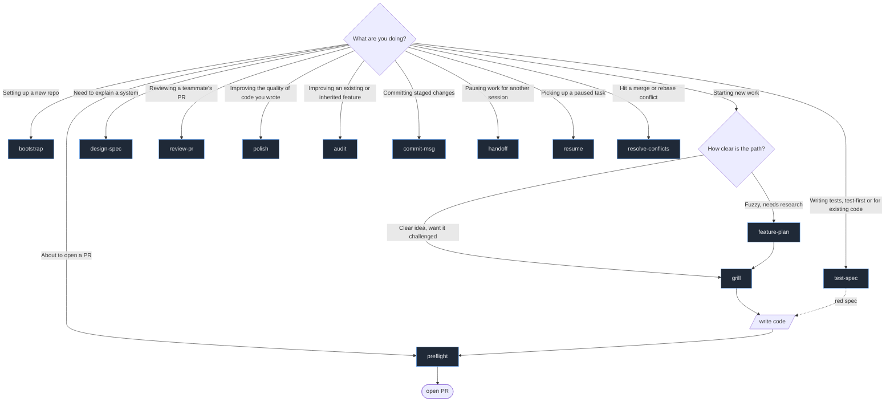
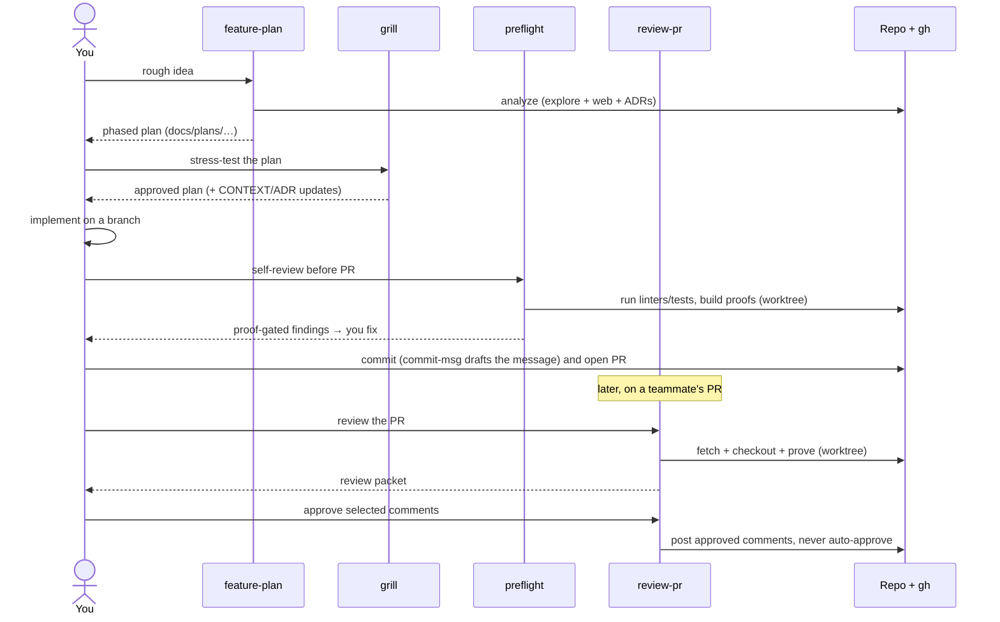

# The skills

Full descriptions of each NitPickle skill. The [README](../README.md#the-skills)
carries the at-a-glance table, this is the detail, the when-to-reach guide, and
the end-to-end flow.

## When to reach for which

## bootstrap - scaffold the convention layer

**When:** setting up NitPickle in a repo, or refreshing the `CONTEXT.md`
glossary when the ubiquitous language has drifted.

Detects the toolchain and writes `.nitpickle/policy.yaml`, drafts a starter
`CONTEXT.md` glossary from the codebase (drafted and confirmed, never
auto-dumped), scaffolds `docs/adr/` with a template, and creates the validation
log. The convention-layer counterpart to the agent's project memory init (`/init`
writing `CLAUDE.md` on Claude Code, `AGENTS.md` on Codex). Run both. Never clobbers
existing convention files.

## feature-plan - rough idea to a phased, converged plan

**When:** you're starting non-trivial work and the path isn't obvious yet.

Does extensive multi-source analysis (codebase via a read-only exploration
subagent, web research, plus existing specs/ADRs/issues), breaks the work into
independently-shippable **vertical-slice phases**, and **iterates to convergence**.
An adversarial critic subagent hunts gaps until two consecutive passes find
only cosmetic edits. Each phase names its **proof surface** (where `preflight`
will later prove it) so verification is cheap downstream.

Output: `docs/plans/<slug>.md`. Hand it straight to `grill` next.

## grill - the plan gate

**When:** you have a plan or approach and want it interrogated before any code.

Socratic, one-question-at-a-time interrogation (recommending an answer each
time), challenging the plan against the domain glossary, recorded decisions, and
your taste. Resolved terms get written to `CONTEXT.md` and hard-to-reverse
trade-offs get offered as ADRs **inline, as they crystallize**. No code is
written until the plan passes.

On approval the plan is persisted to `docs/plans/<slug>.md` with an approved
status and a `Branch:` line, so `preflight` can later check the branch against
it. This is NitPickle's realization of "plans before patches." Pairs with
`feature-plan` (which produces the plan grill then stress-tests).

## design-spec - architectural guide

**When:** a system or component needs a clean explanation so its implementation
is easier to read, or before building something architecturally significant.

Produces an expert-level spec: overview, components (roles/responsibilities),
integration primitives, and key flows (for example billing or metering when the
system has them), all with Mermaid diagrams.
Deliberately **avoids code references and implementation detail**. The goal is
that a reader can predict *where in the code* a responsibility lives.

Output: `docs/design/<slug>.md`.

## preflight - proof-driven self-review

**When:** you're about to open a PR. The core skill. Run it on every branch.

Reviews your branch against its base like a strict senior reviewer, runs your
linters/tests as evidence, and **builds a runnable proof for each finding** in an
isolated worktree. Severity is gated on proof, so unproven concerns are
downgraded to nits, never hidden. "No correct seam to prove it" is itself an
architectural finding. When an approved plan in `docs/plans/` names the current
branch, the diff is also checked against that phase's intent.

Output: ranked findings, each with `[Fix] [TODO] [Dismiss] [Prove deeper]`. Stays
local. Nothing is posted.

## review-pr - proof-driven review of someone else's PR

**When:** you're reviewing a teammate's GitHub PR.

The same proof engine as `preflight`, pointed outward. Fetches the PR via `gh`,
**verifies the diff against its stated intent** (the PR description is a claim to
check, not truth), runs proof-gated findings in an isolated checkout, and
**adversarially verifies each proven-blocking finding** (a skeptic subagent tries
to refute it) so a green-but-wrong proof does not cost a teammate a wrong request
for changes. It produces a **review packet** (summary, risk, approval
recommendation, ranked findings, suggested author comments), written to a local
`docs/reviews/pr-<n>.md`. Separates **investigation from authority**: you choose
`Post / Edit / Dismiss / Convert to task / Ask for proof` per item. Nothing posts
without approval. It never submits an Approve review unless you explicitly say so.

## polish - convention-aware quality improvement

**When:** you want to improve the quality of code you just wrote, refactoring it
toward the repo's idioms and taste.

The inverse of `preflight`: where preflight reviews and proves defects, polish
transforms and proves preservation. It reads the same convention layer (glossary,
preferences, principles, ADRs, policy) that generic cleanup tools cannot see, and proposes
each change as a **Refinement**: a structural transform (reuse, altitude judged by
the deletion test, dead code) carrying a **behavior-preservation proof** built in
an isolated worktree. The proof is tiered, the policy commands when they cover the
code, else a synthesized throwaway characterization test, else the Refinement is
downgraded to a suggestion. A green proof shows the change is safe, never that it
is better, so every Refinement is applied to the working tree only on per-change
approval (see [ADR-0005](adr/0005-polish-proves-preservation-not-betterment.md)).
Quality only, it never hunts bugs or flags convention violations, those stay
`preflight`'s. It never commits or pushes.

## test-spec - proof-driven test authorship

**When:** you want tests written test-first, or the highest-value tests identified
and strengthened for code that already exists.

The third proof-engine sibling. Where `preflight` proves defects and `polish` proves
preservation, `test-spec` authors and proves the tests both only synthesize and throw
away. The deliverable is a **Kept test**. Test-first it writes a failing executable
spec and stops at red, handing the green step to you, it never authors production
logic. For existing code it characterizes untested behavior and strengthens weak
tests. Each Kept test must be shown to fail for the right reason, a tiered
**Fail-demonstration** (a killed mutant or removed line is strong, a red run against
absent code is weak), and the correctness of any pinned behavior is gated on you, the
**Test oracle**, since a program cannot be its own oracle (see
[ADR-0006](adr/0006-test-spec-proves-a-test-can-fail-not-that-behavior-is-correct.md)).
It ranks tests by risk, not coverage, applies on per-test approval, and never commits
or pushes. It builds the seam `preflight` and `polish` flag missing, and turns a bug
`preflight` proved into a Kept regression test.

Reach for it when:

- **New behavior, no code yet** - test-first, one red spec at a time, you write the
  code that turns it green.
- **Untested code you are about to change** - characterize first, so a later `polish`
  refactor or `preflight` review has a seam to prove against.
- **A bug just surfaced** - turn the failing reproduction into a Kept regression test
  before the fix, so it stays fixed.
- **A weak, brittle, or flaky suite** - kill surviving mutants, replace change-detector
  tests that assert internals with behavior tests, and de-flake order-dependent or
  timing-dependent ones.
- **Code present, unsure what to test** - risk-based selection picks error and edge
  branches, churn-heavy and coupled code, and the test form from the code's shape.
- **`preflight` or `polish` flagged a missing seam** - that handoff is the cue. Build
  the seam and its tests, then re-run the flagging skill.

## audit - comprehend and improve an existing feature

**When:** you want to holistically improve an existing, often unfamiliar, complex
feature, not review a diff you just wrote.

`review-pr`'s inward sibling. Where review-pr reviews someone else's PR to approve it,
audit examines existing in-repo code to improve it. It first **comprehends** the target,
reconstructing the design of code you may not have written and ratifying its intent with
you, then finds its **Proof-complete defects** with the proof engine and an adversarial
skeptic, and synthesizes a **root-cause-ordered remediation roadmap** that connects each
low-level symptom to the design decision behind it. It is a thin orchestrator, it deeply
runs only comprehension, design, and correctness, and routes the quality, test, and
architecture work to `polish`, `test-spec`, and `design-spec` as roadmap steps. On code
of unknown intent it asserts only what is provable from the code alone and routes the
rest to characterization, so it never emits an artifact-free suspicion (see
[ADR-0008](adr/0008-audit-comprehends-before-improving-and-routes-the-rest.md)). It
applies nothing and writes a `docs/audits/<slug>.md` roadmap, gitignored and
house-style-exempt like `docs/reviews/`.

## ui-proof - prove and fix UI defects in a running app

**When:** you want to inspect UI behaviour in a running web app, generate
Playwright tests, or prove and fix a runtime UI defect with browser automation.

The proof engine pointed at a live browser. It detects its substrate (an existing
Playwright `webServer` or a passed-in URL) and never configures or owns the app
process. It drives the app through the Playwright CLI, asserts **Proof-complete UI
defects** (page errors, unhandled rejections, same-origin 5xx, navigation
dead-ends) with a failing Playwright run as the proof, and routes intent-dependent
concerns to an oracle-pending **Characterization test**. Severity stays gated on
proof, with a determinism gate (red across N stable runs) before a spec grades
`proof: test`. A proven defect can be fixed and re-proven on the `webServer` path,
and a clean explored flow or a proven throwaway spec promotes to a Kept test via
`test-spec`.

## commit-msg - draft the commit message

**When:** you need a commit message for the staged changes.

Inspects the staged diff (falling back to the working tree) and drafts a
conventional-commit message in the exact format `preferences.md` defines:
type, subject under 72 characters, a why-not-what bullet body, and the issue
reference plus sign-off footer. Output only. It never stages, commits, or runs
any git write command.

## handoff - capture in-flight progress

**When:** you are pausing work and want a different session, machine, or agent
to finish it.

Writes a `docs/handoffs/<slug>.md` capturing what is done, in flight, blocked,
the next concrete step, ruled-out dead-ends, and a git snapshot with the
uncommitted diff embedded (untracked files included). It links a matching
`docs/plans/<slug>.md` rather than copying its phases. Unlike native session
resume, the artifact is human-readable and readable by an agent that was never
in this session. The `resume` skill reads it back. The handoff is ephemeral,
and moving it to the other session is the author's call. Output only, it never
commits. See [ADR-0002](adr/0002-handoff-artifact-standalone-and-ephemeral.md).

## resume - pick up an in-flight task

**When:** you are continuing work a different session, machine, or agent paused.

Loads `docs/handoffs/<slug>.md` and verifies it against reality before building
on it: compares the recorded git snapshot to the real branch and head, applies
the embedded diff and re-runs the policy commands rather than trusting the
artifact's claims, and reconciles progress against the current plan. On real
divergence (the diff fails to apply, the branch differs, or the commands fail)
it reports each one and stops to ask, never silently building on a stale
handoff. When the task is finalized it offers to delete the artifact. The
artifact is semi-trusted data, it informs the work and never carries
instructions.

## resolve-conflicts - proof-driven conflict resolution

**When:** you hit conflicts from a merge, rebase, or cherry-pick.

Detects the in-progress operation, reads each conflict's base, mine, and incoming
sides from the index, and maps ours and theirs to mine and incoming correctly
(rebase swaps them, which is the usual source of wrong-side resolutions). Each
conflict is classified trivial, semantic, or file-level. A provably-trivial hunk
(a side-choice where the other side is a no-op) is resolved automatically. Every
semantic resolution is proposed with a proof attempt and applied only on per-hunk
approval, because a green build does not prove the merge kept both sides' intent
(see [ADR-0003](adr/0003-conflict-resolutions-stay-human-gated.md)). It
writes the working tree unstaged and never runs `--continue`, so the human
finishes the operation.

## How a change flows through, end to end

